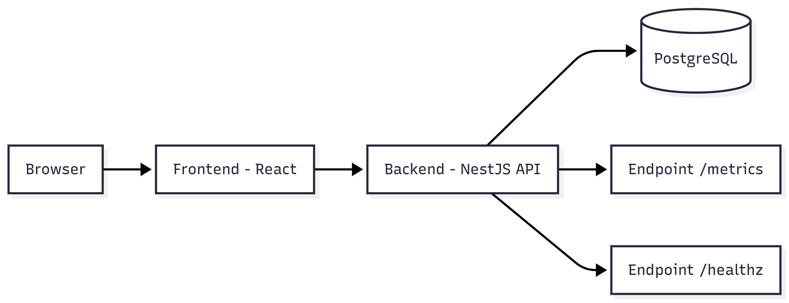
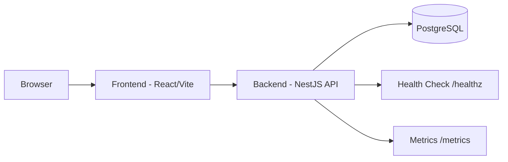
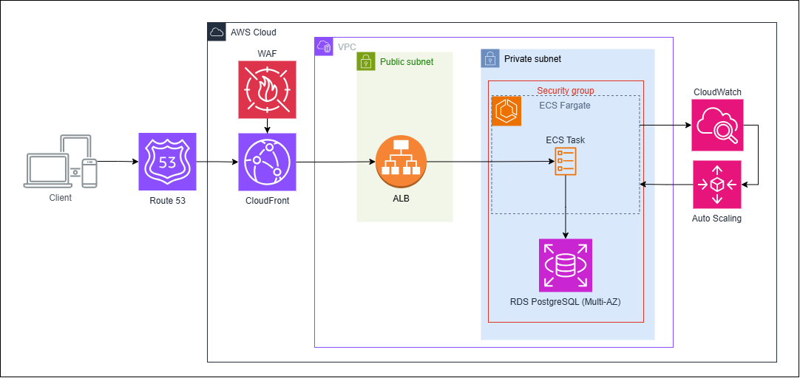

# Desafio Técnico — Sistema de Gestão de Clientes

Este projeto implementa um MVP full-stack de gestão de clientes com autenticação, CRUD, dashboard administrativo e observabilidade básica, conforme especificação do desafio.

A aplicação foi construída com foco em organização arquitetural, separação de responsabilidades e escalabilidade.

---

# 🎯 Visão Geral

O sistema permite:

- Autenticação de usuários com JWT
- CRUD de clientes com soft delete
- Listagem paginada de clientes
- Dashboard administrativo com métricas
- Contador de acessos por cliente
- Auditoria com timestamps
- Monitoramento da aplicação via métricas e health check

O projeto está organizado como **monorepo Nx**, contendo:

- Frontend (React + Vite + TypeScript)
- Backend (NestJS + TypeORM + PostgreSQL)

Cada aplicação possui ambiente Docker isolado.

---

# 🏗️ Arquitetura — Visão Local

### Fluxo da aplicação

Browser → Frontend → Backend API → Banco de Dados

### Portas e serviços

- Frontend → http://localhost:5173
- Backend API → http://localhost:3000
- Swagger → http://localhost:3000/docs
- PostgreSQL → localhost:5432
- Redis (opcional) → localhost:6379

---

# 📊 Diagrama de Arquitetura





---

# 🚀 Instruções Gerais — Execução Local

## 📦 Pré-requisitos

Certifique-se de possuir instalado:

- Docker
- Docker Compose

Não é necessário instalar Node.js localmente.


## ⚙️ Passo 1 — Configurar variáveis de ambiente

Copie os arquivos de exemplo de cada aplicação:

```bash
cp frontend/.env.example frontend/.env
cp backend/.env.example backend/.env
```

## ▶️ Passo 2 — Subir Backend e Banco de Dados

O backend inicia junto com o banco PostgreSQL.

Execute:

```bash
cd backend
docker compose up --build
```

---

## ▶️ Passo 3 — Subir Frontend

Em um novo terminal, execute:

```bash
cd frontend
docker compose up --build
```


# 📊 Observabilidade

Foram implementados mecanismos básicos de observabilidade para monitoramento da aplicação:

- Logs estruturados em JSON → facilitam análise e integração com ferramentas de monitoramento
- Endpoint /healthz → permite verificação de saúde da aplicação por orquestradores
- Endpoint /metrics → expõe métricas no formato Prometheus
- Auditoria com timestamps → permite rastreabilidade de operações

Essas práticas são essenciais para operação confiável em produção.

# ☁️ Arquitetura — Visão AWS (Proposta)



---
A aplicação foi projetada para ser implantada na AWS utilizando serviços gerenciados, garantindo escalabilidade, segurança e observabilidade.

O tráfego dos usuários é resolvido via Route 53 e distribuído globalmente pelo CloudFront. O AWS WAF é aplicado na camada de edge para bloquear tráfego malicioso antes que ele alcance a infraestrutura interna.

Dentro da VPC, o Application Load Balancer recebe as requisições e as direciona para containers executando em ECS Fargate, configurados com Auto Scaling baseado em métricas do CloudWatch, permitindo escalabilidade horizontal conforme demanda.

A aplicação executa em subnets privadas, protegida por Security Groups, enquanto o banco de dados PostgreSQL roda em RDS Multi-AZ para alta disponibilidade e tolerância a falhas.

A observabilidade é garantida através do CloudWatch, responsável por métricas, logs e suporte às políticas de escalabilidade automática.

Essa arquitetura garante isolamento de rede, proteção em múltiplas camadas e capacidade de crescimento sob demanda, mantendo baixo overhead operacional.

---